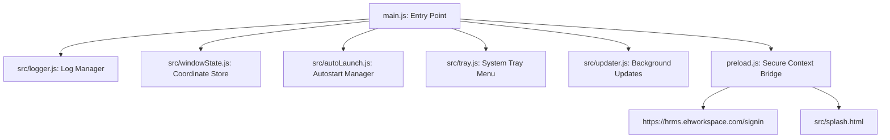

# HRMS Desktop Client - Production & Architecture Guide

This document outlines the architecture, file structure, configuration, and build instructions for the **HRMS Desktop Portal**, a cross-platform desktop wrapper for `https://hrms.ehworkspace.com/signin` built with **Electron.js**.

---

## 1. Project Directory Structure

The project has been configured with a clean, modular structure as follows:

```
hrmswindowapp/
├── assets/
│   ├── icon.ico            # Windows application & installer icon (PNG-wrapped)
│   ├── icon.png            # Linux desktop and tray icon (512x512 PNG)
│   └── icon.icns           # macOS icon container (PNG-wrapped)
├── build/                  # Target output folder for electron-builder binaries
├── scripts/
│   └── generate-assets.js  # Script to compile icons from master PNG
├── src/
│   ├── autoLaunch.js       # Cross-platform startup helper (Windows Registry / Linux .desktop)
│   ├── logger.js           # Logging system using electron-log
│   ├── splash.html         # High-fidelity glassmorphic splash screen
│   ├── tray.js             # System tray creation and context menus
│   ├── updater.js          # Auto-update lifecycles using electron-updater
│   └── windowState.js      # Custom, zero-dependency window coordinates persistence
├── package.json            # Scripts, dependency locks, and electron-builder configs
├── preload.js              # Secure IPC API bridge (contextBridge)
└── main.js                 # Electron main process entrypoint
```

---

## 2. Core Modules Architecture

To maintain a clean and TypeScript-ready codebase, the system is divided into modular helper scripts:



### Module Breakdown

1. **`main.js`**: Controls the application lifetime. It intercepts the single-instance lock to restrict the app to one running instance per computer, spawns the splash screen, triggers background update processes, initializes the main viewport, and coordinates transition phases.
2. **`preload.js`**: Establishes a secure bridge (`contextBridge`) between Electron's internal APIs and the renderer context. It enforces `contextIsolation` and Node.js sandbox modes.
3. **`src/logger.js`**: Standardizes error handling and info logs. It writes output to the console (development) and files (located in the user data directory's `logs/main.log`). Uncaught exceptions are intercepted automatically.
4. **`src/windowState.js`**: Listens to main window resizing and coordinate shifts. It writes these boundaries to `window-state-main.json` so the viewport restores exactly to its previous location on startup.
5. **`src/autoLaunch.js`**: Integrates startup triggers. On Windows, it binds to `app.setLoginItemSettings`. On Linux distributions (Ubuntu, Debian, Mint), it creates/removes a valid `.desktop` autostart launcher under `~/.config/autostart/`.
6. **`src/tray.js`**: Handles minimizing-to-tray. Right-clicking the tray exposes a menu showing live auto-launch settings, manual update checks, and application termination switches.
7. **`src/updater.js`**: Wraps `electron-updater` to orchestrate background updates. It alerts users via OS message dialogs when updates are ready to apply.
8. **`src/splash.html`**: A frameless window representing loading status. Implements modern typography and CSS mesh gradients.

---

## 3. Configuration & Compilation Scripts

The build pipeline uses `electron-builder` to target Windows, macOS, and Linux platforms from a unified workspace configuration located inside `package.json`.

### Build Targets
*   **Windows**: Outputs a customized **NSIS Installer (.exe)** supporting custom directories, desktop shortcuts, and Start Menu links.
*   **macOS**: Outputs a **DMG Installer (.dmg)** and a standard zipped application bundle (**macOS App**).
*   **Linux**: Outputs an **AppImage** (universal executable) and a **Debian Package (.deb)** (fully compatible with Ubuntu, Debian, and Linux Mint).

### Command List

Run these commands in the terminal depending on your target:

| Platform Target | Command | Output Format | Output Directory |
| :--- | :--- | :--- | :--- |
| **Development Mode** | `npm run dev` | Interactively run live portal | Console/Window |
| **Windows Build** | `npm run build:win` | NSIS Installer (`.exe`) | `build/` |
| **Linux Build** | `npm run build:linux` | AppImage & Debian Package (`.deb`) | `build/` |
| **macOS Build** | `npm run build:mac` | DMG & App Zip (`.dmg`, `.zip`) | `build/` |
| **All Platforms** | `npm run build:all` | Compile Win + Linux + Mac outputs | `build/` |

---

## 4. Production Code Signing Guidelines

For distribution in commercial environments, you should set up code signing to prevent OS warning screens (such as Microsoft Defender SmartScreen, macOS Gatekeeper, or Linux installation prompts).

### Windows Signing
To sign the Windows `.exe` installer, you need a valid **Code Signing Certificate (EV or OV)**:
1. Store your certificate in PFX format.
2. Define the following environment variables on your CI/CD pipeline or build machine before running `npm run build:win`:
   *   `CSC_LINK`: Path or URL to your `.pfx` certificate file.
   *   `CSC_KEY_PASSWORD`: Password to decrypt the certificate file.

### macOS Signing & Notarization
To distribute desktop software on macOS outside the Mac App Store without triggering Apple Gatekeeper security warnings:
1. You must have a valid **Apple Developer Account** and a **Developer ID Application** certificate.
2. For automatic signing and notarization during packaging, set the following environment variables:
   *   `CSC_LINK`: Base64 encoded `.p12` certificate or path to your `.p12` file.
   *   `CSC_KEY_PASSWORD`: Password for the `.p12` file.
   *   `APPLE_ID`: Your Apple ID email address.
   *   `APPLE_ID_PASSWORD`: An app-specific password generated via account.apple.com.
   *   `APPLE_TEAM_ID`: Your 10-character Apple Developer Team ID.

### Linux Packages
For Debian (`.deb`) distributions, packages are typically signed using GPG:
1. Generate a GPG key pair.
2. `electron-builder` will automatically search for available GPG configurations to sign packages.
